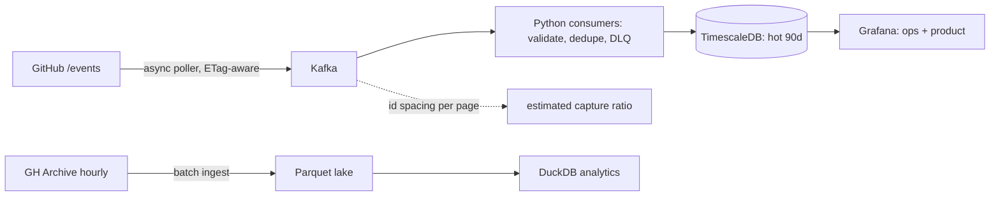

# RepoRadar — ecosystem intelligence for open source

RepoRadar ingests the public GitHub event firehose and turns it into three answers that
engineering teams actually need:

1. **"Is this project's momentum real?"** — trend detection with fake-star / coordinated-campaign
   screening, evaluated as alert precision under an explicit review budget.
2. **"Which of our dependencies are at risk of abandonment?"** — survival-analysis risk scores
   (who maintains what we depend on, and is the project decaying?), backtested for warning lead time.
3. **"What actually causes adoption?"** — event studies on natural experiments: license changes,
   front-page moments, CVE disclosures.

The core is deliberately boring and statistical: pipelines, reconciliation, baselines,
calibration. A local-LLM layer will eventually write weekly ecosystem briefs — with a plain
template fallback, so no model is ever a point of failure.

> **Status:** early development. In place today: ingestion foundations (a live `/events`
> poller with bounded deduplication and run counters, an always-on capture service writing
> hourly NDJSON files, idempotent GH Archive hour downloads), DuckDB archive analysis and
> feed-coverage estimation behind the `reporadar` CLI, and a local compose stack (Kafka,
> TimescaleDB, Grafana). The changelog tracks what is actually in place.

## The honest-ingestion design

GitHub's `/events` API is a **fast but lossy** window: pagination caps what one poller sees at
peak, so a single poller necessarily misses events. [GH Archive](https://www.gharchive.org/)
publishes an hourly record of public events. The obvious design is to reconcile one against the
other and report the difference as a capture rate.

**That design is not used here, and the reason was measured rather than assumed.** In the hours
sampled, the live feed and the published archive did not share events: none of a live sample's
event ids appeared in the archive hour covering the same period, and matching instead on the
commit SHA carried by a push — a value that cannot differ between two records of the same event —
found no meaningful overlap in the adjacent hours either. Whatever the cause, the archive could
not act as ground truth for what this poller missed, so a figure derived by reconciling the two
would report the mismatch rather than the miss.

Coverage is therefore estimated from the live feed alone. Events within a returned page are
consecutive, which makes the spacing between event ids measurable *inside* each page instead of
configured; the ids elapsed between two cycles then imply how many events occurred, and the share
the poller actually captured is an **estimated capture ratio**. It is an estimate, it is named as
one wherever it appears, and it carries one stated assumption: that a returned page is contiguous.



Design rules that hold everywhere:

- **Coverage is measured, never assumed — and the measurement says what it cannot know.** Where a
  number cannot be computed honestly the code declines to produce one, rather than returning a
  plausible zero.
- **Every model must beat a named dumb baseline on a time-based split** before it ships.
- **Person-level data is aggregated to repo/ecosystem level** in everything published. No
  individual-maintainer risk pages, ever.

## Development

```bash
make setup        # uv sync + install pre-commit hooks
make lint test    # zero-warning gate: ruff, mypy --strict, pytest
```

Python 3.12; dependencies and the toolchain are managed with [uv](https://docs.astral.sh/uv/).

## Usage

```bash
reporadar fetch-archive 2026-07-07 15     # download one GH Archive hour (.json.gz)
reporadar explore data/raw/gharchive/2026-07-07-15.json.gz   # event-type histogram
reporadar poll --cycles 10 --interval-s 10                   # sample the live /events feed
reporadar serve                                              # always-on capture → files + stream
reporadar consume                                            # stream → validated store
reporadar archive-serve                                      # keep the columnar store converged
reporadar backfill 2026-07-21 2026-07-22                     # ingest one explicit range of days
reporadar verify                                             # does the store match its record?
reporadar provision                                          # create the Kafka topics
reporadar capture-rate <archive.json.gz> <live.ndjson>       # compare a sample to an archive hour
```

`serve` polls until stopped, writing fresh events into hourly NDJSON files that mirror the
archive layout **and** publishing them to the Kafka stream that `consume` reads. The files are
the capture record, so a write failure there stops the run; the stream is best-effort, so
a broker outage is logged and counted rather than halting capture. It needs the broker up and
the live topic provisioned; Ctrl-C or SIGTERM ends the run cleanly after the current cycle.
`consume` is the other half: it reads the stream into the database, sending anything that
will not decode to the dead-letter topic, and stops on the same signals. It needs the local
stack running and `REPORADAR_POSTGRES_DSN` set.
`provision` creates the topics the stream needs. It is idempotent, so re-running it is free,
and it never alters a topic that already exists — if one is sized differently it says so and
leaves it alone. `provision --check` reports without creating and exits non-zero when the
broker is not ready, which makes it usable as a deploy gate. The reading commands verify the
topics before they start, so a fresh broker fails immediately and says what to run.
`archive-serve` keeps the columnar store converged on the published archive: it asks the hours
record what is outstanding, converts those hours a few at a time, and repeats on an interval.
There is no schedule and so no missed run — downtime, a partial failure and an hour published
late all resolve on the next pass. `backfill` runs the same pass once over an explicit range of
days and stops; unlike the service it also retries hours previously found unreadable, which is
how a fix reaches the hours it fixes. Both need `REPORADAR_POSTGRES_DSN` and no broker at all.
Both also remove each hour's compressed source once the record of it is written, reporting the
bytes reclaimed: the columnar copy is what the record points at, while the source is a cache of a
file the publisher still serves, and keeping both costs two and a half times the disk. Pass
`--keep-source` when the raw hour is the thing you want to look at.
`verify` compares the hours record against the columnar store. It exits non-zero when the record
claims an hour that is not on disk — the failure that matters, because nothing revisits a settled
hour, so such a gap is permanent and every coverage number reports it as complete. A file that no
row claims is reported without failing: it misstates nothing, and the next scan converts that hour
again. The default check is one filesystem call per recorded hour and compares the stored size as
well as presence; `--counts` also compares event counts, which reads the whole store in one query.
`capture-rate` compares a live sample against one archive hour. It reports the counts and
refuses to return a ratio when the sample holds events that the archive hour does not — which, on
the hours measured so far, is what happens, and is why coverage is estimated from the live feed
instead. It exits non-zero in that case, so a scheduled run cannot record a number that means
nothing.

## Local stack

Kafka (KRaft), TimescaleDB, and Grafana for local development:

```bash
cp .env.example .env      # then set POSTGRES_PASSWORD and GRAFANA_ADMIN_PASSWORD
make up                   # start the stack (host ports are shifted off the defaults)
make provision            # create the topics (once per broker; safe to repeat)
make logs                 # follow logs
make down                 # stop it
```

`make up` starts the infrastructure only, so running it never begins polling GitHub.

## Running the services in containers

The four long-running commands ship as one image — they differ only by the command they are
given, so no deployment can put a different build behind one process than another. They sit
behind a compose profile, which is what keeps `make up` an infrastructure-only command:

```bash
make up-app               # infrastructure + provision + serve, consume, archive-serve
make logs-app             # follow the application logs
make down-app             # stop everything
```

Configuration comes from the same `.env`, with one wrinkle worth knowing: `.env` holds the
addresses a developer needs **from the host** (`localhost` and shifted ports), and inside the
network `localhost` is the container. The compose file therefore overrides the broker address
and the database DSN with their in-network equivalents (`kafka:19092`, `timescaledb:5432`) for
the application services only. Scan bounds are passed on the command line and can be overridden
from `.env` — see `ARCHIVE_SCAN_INTERVAL_S`, `ARCHIVE_CONCURRENCY`, `ARCHIVE_LOOKBACK_DAYS`,
`SERVE_INTERVAL_S` and `SERVE_PAGES` in `.env.example`.

Everything writes into one named volume mounted at `/app/data`, the image runs as an
unprivileged user, and the services restart unless explicitly stopped. A restart costs nothing:
the archive ingest re-derives what is outstanding from the hours record rather than resuming a
plan, so it converges again from wherever it was interrupted.

## Compliance

Independent research project; **not affiliated with or endorsed by GitHub**. Data comes from
the official GitHub REST API (authenticated, within published rate limits) and GH Archive —
no scraping. Person-level signals are aggregated to repo/ecosystem level in everything
published; raw event data is never redistributed as a dataset.

## License

[MIT](LICENSE)
