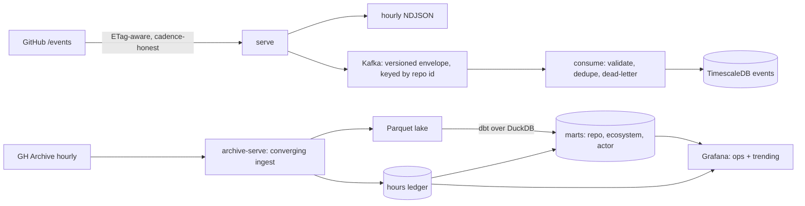

# RepoRadar — ingesting and measuring GitHub's public event feed

RepoRadar reads GitHub's public event feed two ways — the live `/events` API and the hourly
[GH Archive](https://www.gharchive.org/) — reconciles what landed against a record of what was
supposed to, aggregates it into daily marts, and charts day-over-day movement. It runs locally, end
to end: an empty directory to a provisioned dashboard in the commands below.

The pipeline was the instrument. It was pointed at one question about the feed, that question now has
a measured answer, and the project is closed on it.

## What the feed turned out to be

**The public event feed is overwhelmingly automated, and there is nothing worth classifying, because
the base rate already answers the question.**

The setup was fixed before anything was scored, so it could not be chosen to fit. The unit is one
repository-day, not one event — a per-event unit lets the highest-volume repositories decide the
score by themselves. Three days were used to fit (2026-07-22, 07-27, 07-28) and one held out
entirely (2026-07-29: 3,978,401 events across 555,841 repositories). There is no ground truth for
"automated", so the label is named as the proxy it is: exactly one distinct account, and at least
twenty events.

Among repository-days carrying twenty or more events on the held-out day, **95.5% already have
exactly one account** — 23,155 of 24,253. Predicting that for every one of them scores precision
0.9547, recall 1.000, **F1 0.9768**. The cheap repository-name pattern this analysis was built to
test reaches precision 0.9889: **a lift of 1.04× over guessing**. Combining the two is worse than the
better of them, because the name rule's 0.81 recall drags down a rule that recalls everything.

So the feed is not a population containing automation. It is automation, carrying a trace of
everything else. Once volume is high enough to be worth looking at, single-actor is the default, and
anyone consuming this feed can discard the automated bulk with a counter and no model at all.

### The caveat that generalises

The pattern that looked decisive matches **13.97% of repository-days** and **69.81% of events** on
the same day. Weighted by events it looks like a thirteenfold separation. Measured per
repository-day, where the claim actually lives, it adds 3.4 percentage points to a 95.5% base rate.

**A share-of-events figure is a claim about volume, not about population.** That is how a 1.04×
effect presents itself as 13×, and it applies to every rate on this page.

### No single number answers "how much of it is automated"

| day | automated share of events | share of repositories |
|---|---|---|
| 2026-07-22 | 68.96% | 3.05% |
| 2026-07-27 | 72.53% | 3.21% |
| 2026-07-28 | 73.78% | 3.64% |
| 2026-07-29 | 74.60% | 4.17% |

Four days, moving one way on both columns, a spread of 5.64 points. Four points is not a trend, but
it is a refusal to be a constant — which is enough to retire the headline figure. Any single number
quoted for this is a number about a day.

### What stays clean

`WatchEvent` is **0.033%** of everything published, and **99.98%** of the 5,258 stars observed over
four complete days land outside the automated population — one in 5,258 does not. The human-attention
signal here is tiny and it is uncontaminated, which is the property that makes ranking on distinct
accounts work at all.

### The comparison that had to be thrown away

The first version of this had a baseline that could not lose. The label was "one account **and**
twenty or more events"; the baseline was a threshold on event count, and the search picked twenty —
the label's own constant. The baseline did not compete with the label, it contained half of it, and
its recall came back as exactly 1.0000.

Nothing in the output said "leak". An F1 of 0.9768 looks like a strong result, and the only tell was
a recall of *exactly* 1.0000 at a threshold landing *exactly* on the label's constant. A metric that
cannot fail is not a weak metric — it is a different object, and it is indistinguishable from a good
result until you ask what it would print if the claim were false. The run above removes the leak by
making volume a filter rather than a feature: among repository-days above twenty events, does the
name predict a single account? That question has an honest answer, and the answer is *barely*.

## How it is built



Two paths, deliberately separate. The live path is a poller that honours the cadence the API asks
for, deduplicates within a bounded window so a long run is not a slow memory leak, writes fresh
events into hourly NDJSON files that mirror the archive layout, and publishes them to Kafka in a
versioned envelope keyed by repository id, so one repository's events stay in order. A consumer
validates every message against that wire contract, stores what decodes into a TimescaleDB
hypertable, and routes what does not to a dead-letter topic with a triage reason attached, so an
operator reads a reason rather than a stack trace.

The archive path downloads published hours, converts them into a partitioned Parquet lake, and
records each hour in a ledger. A level-triggered loop keeps the two converged: it asks the ledger
what is outstanding rather than following a schedule, so downtime, a partial failure and an hour
published late all resolve on the next pass. `verify` checks the ledger against the files in both
directions, and `repair-lake` acts on what it finds.

Everything published is built from the lake by dbt, at three grains — per repository per day, per
day for the whole ecosystem, per account per day — plus a trending model that ranks movement in
distinct accounts. The dashboards are files in this repository, provisioned into Grafana on startup.

Three commitments hold everywhere in it:

- **Where a number cannot be computed honestly, the code declines to produce one** rather than
  returning a plausible zero. This cost the project a headline metric; see below.
- **Any model has to beat a named dumb baseline on a time-based split before it ships.** Exactly one
  candidate ever reached that gate, and what it added over the baseline was 1.04×. That is the
  finding above.
- **Person-level data is aggregated to repository or ecosystem level in everything published**, and
  the database enforces it rather than a convention.

## Two things this deliberately does not have

### It does not report what share of the feed it sees

GitHub's `/events` API is a fast but lossy window: pagination caps what one poller sees at peak, so a
single poller necessarily misses events. The obvious design reconciles the live feed against the
published archive and reports the difference as a capture rate.

**That design is not used, and the reason was measured rather than assumed.** In the hours sampled,
the live feed and the published archive did not share events: none of a live sample's event ids
appeared in the archive hour covering the same period, and matching instead on the commit SHA
carried by a push — a value that cannot differ between two records of the same event — found no
meaningful overlap in the adjacent hours either. Whatever the cause, the archive could not act as
ground truth for what this poller missed, so a figure derived by reconciling the two would report the
mismatch rather than the miss.

Coverage was therefore estimated from the live feed alone, and a figure was published: 2.08%, for one
poller at three pages per 60-second cycle over a single 30-minute window. It rested on two
assumptions. That a returned page is contiguous — checked, and it holds. That the spacing between
event ids measured *inside* a page describes the spacing *outside* it — checked, and it does not.
Ids arrive in dense clusters, neighbours a couple of ids apart inside one and consecutive clusters
thousands apart, so measuring inside a cluster and applying it across the gaps prices empty id space
at the density of a burst.

**The estimator was fixed, and then removed anyway.** The fix changes nothing on the live feed: a
page spans about one cluster, so there is no boundary for the two versions to disagree about, and 48
consecutive cycles produced results identical to the last float bit. Nor can it, at any setting — the
endpoint refuses a fourth page and caps a hundred per page, which is smaller than the gap the fix
exists to detect. What remained was a residual error of roughly 8.6× against an independently
measured event rate, with no mechanism behind it. One piece of evidence that had supported keeping
the estimator was withdrawn on inspection: the arithmetic said to corroborate the correction turned
out to be an identity, true for any input, and so incapable of failing.

So the estimate is retired and the module that computed it is deleted. What the poller reports is
exact counts — cycles, events fetched, events new — and the question *what fraction of GitHub is
that?* is left open and named as open. **A number wrong by an unexplained factor is not a rough
version of the right number.** It is named here rather than quietly dropped, because a capability
that was removed and one that never existed look identical from outside.

### The result is published; the system is not hosted

The finding is a page anyone can read — **<https://deeason7.github.io/reporadar/>** — built by
`make site` from the same Parquet lake the numbers come from, committed to `docs/`, and served as a
static file. Nothing runs behind it. Every figure on it is re-derived at build time rather than
typed in, so a rebuild over an unchanged lake reproduces it byte for byte and a stale number cannot
survive one.

The pipeline itself runs on one machine and stops there. Hosted deployment was in scope and was cut
under a zero-cost constraint: every free option either loses its disk between restarts, sleeps on a
timer that a capture pipeline would end up measuring instead of GitHub, or requires a card.
**Publishing a result is not running a system**, and the page does not close that gap — the goal is
recorded as missed rather than redefined into one that was met. Reproducing the stack from this
README is what the project offers instead, and the commands below are the whole of it.

## Usage

```bash
reporadar fetch-archive 2026-07-07 15     # download one GH Archive hour (.json.gz)
reporadar explore data/raw/gharchive/2026-07-07-15.json.gz   # event-type histogram
reporadar poll --cycles 10 --interval-s 10                   # sample the live /events feed
reporadar serve                                              # always-on capture → files + stream
reporadar consume                                            # stream → validated store
reporadar archive-serve                                      # keep the columnar store converged
reporadar backfill 2026-07-21 2026-07-22                     # ingest one explicit range of days
reporadar verify                                             # does the store match its record?
reporadar repair-lake --dry-run                              # and if it does not, fix it
reporadar provision                                          # create the Kafka topics
reporadar capture-rate <archive.json.gz> <live.ndjson>       # compare a sample to an archive hour
```

`serve` polls until stopped, writing fresh events into hourly NDJSON files that mirror the
archive layout **and** publishing them to the Kafka stream that `consume` reads. The files are
the capture record, so a write failure there stops the run; the stream is best-effort, so
a broker outage is logged and counted rather than halting capture. It needs the broker up and
the live topic provisioned; Ctrl-C or SIGTERM ends the run cleanly after the current cycle.
It logs a progress line every `--report-every` cycles — default 60, `0` to silence it — and one
more on exit. The unit is cycles rather than seconds because GitHub sets the cycle length: it
asks for 60s between polls and `--interval-s` cannot go under that, so the default is about an
hour before the first line and lowering `--interval-s` does not shorten the wait.

`consume` is the other half: it reads the stream into the database, sending anything that
will not decode to the dead-letter topic, and stops on the same signals. It needs the local
stack running and `REPORADAR_POSTGRES_DSN` set.

`provision` creates the topics the stream needs. It is idempotent, so re-running it is free,
and it never alters a topic that already exists — if one is sized differently it says so and
leaves it alone. `provision --check` reports without creating and exits non-zero when the
broker is not ready, which makes it usable as a deploy gate. The reading commands verify the
topics before they start, so a fresh broker fails immediately and says what to run.

`archive-serve` keeps the columnar store converged on the published archive: it asks the hours
record what is outstanding, converts those hours a few at a time, and repeats on an interval.
There is no schedule and so no missed run — downtime, a partial failure and an hour published
late all resolve on the next pass. `backfill` runs the same pass once over an explicit range of
days and stops; unlike the service it also retries hours previously found unreadable, which is
how a fix reaches the hours it fixes. It exits `3` when the range did not converge — an hour left
for a later pass, or one that arrived and could not be trusted — because naming a range says those
hours are wanted now, and a caller that branches on the exit code would otherwise read a partial
range as a finished one. An hour the publisher never published does not count against it: that is
a settled answer rather than an unfinished job. Both need `REPORADAR_POSTGRES_DSN` and no broker
at all.

Both also remove each hour's compressed source once the record of it is written, reporting the
bytes reclaimed: the columnar copy is what the record points at, while the source is a cache of a
file the publisher still serves, and keeping both costs two and a half times the disk. Pass
`--keep-source` when the raw hour is the thing you want to look at.

`verify` compares the hours record against the columnar store. It exits `3` when the record
claims an hour that is not on disk — the failure that matters, because nothing revisits a settled
hour, so such a gap is permanent and every coverage number reports it as complete. A file that no
row claims is reported without failing: it misstates nothing, and the next scan converts that hour
again. The default check is one filesystem call per recorded hour and compares the stored size as
well as presence; `--counts` also compares event counts, which reads the whole store in one query.

`repair-lake` is what acts on that. It removes the claims `verify` proved untrue and fetches those
hours again, so the record is written by a real download rather than edited. `--dry-run` reports what
it would do and changes nothing.

**It prints what each removed row claimed beside what the fetch actually found, and that comparison
is the reason it exists.** Repairing thirty-two hours by hand, thirty-one reproduced their recorded
counts exactly — and that agreement is the only thing that made the one hour which did not, recorded
as 100 events and holding 165,892, legible as a bad row rather than as noise. A repair that quietly
fixed would have destroyed the evidence along with the fault.

It removes rows rather than writing over them, which is not squeamishness about deletion. The record
refuses to move an hour off success — the guard that stops a failed fetch erasing a real ingest — so
writing over would correct an hour that comes back and silently leave the false claim standing for
one that does not. Clearing it first is what lets any outcome be recorded honestly, including "the
publisher does not have this hour". It fetches one hour at a time by default, because the publisher
dropped thirteen connections inside a second at three.

**Re-running the ingest does not fix this, and that was measured rather than assumed.** The
convergence loop asks the record which hours are unsettled, and an hour recorded as ingested is
settled whether or not its file exists — so the hours needing repair are exactly the ones it skips. A
range covering thirty-two broken hours reported forty-one due, forty-one ingested, nothing
outstanding, and the same thirty-two failures before and after. The loop is left that way on purpose:
removing a partition directory is a supported way to reclaim disk, and a loop that checked the files
would re-download those hours for ever, undoing a deliberate act.

`capture-rate` compares a live sample against one archive hour. It reports the counts and
refuses to return a ratio when the sample holds events that the archive hour does not — which, on
the hours measured so far, is what happens. It exits non-zero in that case, so a scheduled run
cannot record a number that means nothing. This is the older of the two attempts to measure the
project's own coverage; both were retired, and this command survives as the honest report of why the
first one could not work.

## Local stack

Kafka (KRaft), TimescaleDB, and Grafana for local development:

```bash
cp .env.example .env      # then set POSTGRES_PASSWORD and GRAFANA_ADMIN_PASSWORD
make up                   # start the stack (host ports are shifted off the defaults)
make provision            # create the topics (once per broker; safe to repeat)
make logs                 # follow logs
make down                 # stop it
```

`make up` starts the infrastructure only, so running it never begins polling GitHub.

Every published port binds to `127.0.0.1`, so the stack is reachable from this machine and from
nowhere else. That matters more than it looks: none of these services authenticates a client — the
broker's listeners are `PLAINTEXT` — so a port bound to every interface is an open broker and an open
database to whatever network the machine is on. The commands are meant to be run from the host, so
the ports exist; they just do not need to leave it. Each service also restarts unless explicitly
stopped, and caps its own logs, so neither a reboot nor a long run leaves the stack in a state you
have to clean up by hand.

## Running the services in containers

The four long-running commands ship as one image — they differ only by the command they are
given, so no deployment can put a different build behind one process than another. They sit
behind a compose profile, which is what keeps `make up` an infrastructure-only command:

```bash
make up-app               # infrastructure + provision + serve, consume, archive-serve
make logs-app             # follow the application logs
make down-app             # stop everything
```

Configuration comes from the same `.env`, with one wrinkle worth knowing: `.env` holds the
addresses a developer needs **from the host** (`localhost` and shifted ports), and inside the
network `localhost` is the container. The compose file therefore overrides the broker address
and the database DSN with their in-network equivalents (`kafka:19092`, `timescaledb:5432`) for
the application services only. Scan bounds are passed on the command line and can be overridden
from `.env` — see `ARCHIVE_SCAN_INTERVAL_S`, `ARCHIVE_CONCURRENCY`, `ARCHIVE_LOOKBACK_DAYS`,
`SERVE_INTERVAL_S` and `SERVE_PAGES` in `.env.example`.

Everything writes into one named volume mounted at `/app/data`, the image runs as an
unprivileged user, and the services restart unless explicitly stopped. A restart costs nothing:
the archive ingest re-derives what is outstanding from the hours record rather than resuming a
plan, so it converges again from wherever it was interrupted.

## Building the marts

Daily aggregates are built with dbt. The models run over the Parquet lake and write their
results into Postgres:

```bash
make up                   # the database has to be running
make marts                # build the models and run their tests
make marts-converge       # build them only if the lake has moved since last time
make marts-status         # just say whether they are current, and change nothing
```

The split is deliberate and it is the part worth understanding. **The events are in the lake,
not in the database** — the archive ingest writes Parquet and a record of which hours it has,
and the streaming path is the only thing that writes the `events` table. So the models read the
lake directly, in place, and only the finished aggregates are written to Postgres, which is what
the dashboard can query. The query engine attaches the database for that write, which also lets a
model join what actually landed against the record of which hours were supposed to.

Two things fall out of it. Models are checked against the data on every build, not just parsed:
identifiers are unique, the columns lifted out of the published JSON are not silently null, and
each event's partition still agrees with its own timestamp — the assumption the daily grain rests
on. And the transformation tools are an optional extra (`uv sync --extra dbt`), so the services
that poll, consume and ingest never carry them.

Rare, real gaps are reported rather than hidden or dropped quietly. A few published events carry
an empty repository object — three in the 5,090,496 events measured on 2026-07-28/29, all of them
fork events. Those cannot belong to a per-repository row, so they are excluded from it, and the
tests warn every time one appears instead of passing silently. The build only fails if the count
jumps far enough to mean the envelope changed rather than that the publisher did something rare.

### Keeping the aggregates level with the lake

The ingest converges on its own; the aggregates are built by a command. Left at that the two drift
apart in silence — the charts keep rendering, and the numbers are quietly smaller than the truth.
`make marts-converge` closes it the same way the ingest loop works: not on a schedule, on a
difference. It asks whether the aggregates cover every hour the lake holds, builds only if they do
not, and over an unchanged lake does a directory walk and one small query and stops.

**Nothing records when a build last ran, and that is on purpose.** Each ecosystem row already
carries how many hours it was computed from, so comparing that against the lake answers the
question directly — and it answers a stronger one than a timestamp could, because a build that
finished a minute ago against a lake that has moved since is recent and stale at the same time.

The comparison is against the lake's **files**, not the record of ingested hours, and that
distinction was bought the hard way. The obvious version compares against the record; run against a
working database it reported thirty-two hours behind and prescribed a build that could not have
changed anything, because those hours' files were long gone. A build reads the lake, so only the
lake can say what a build would change. *A check nobody can satisfy is worse than no check* — the
first real staleness it buries is the one nobody looks at any more. A record claiming hours the
lake does not hold is a genuine fault with its own tool: that is what `reporadar verify` reports.

So three checks each own exactly one comparison, and they compose: `verify` checks the record
against the files, `marts-status` checks the files against the aggregates, and the dashboard panel —
being a database connection, and so unable to see files at all — checks the record against the
aggregates. When `verify` passes, the last two necessarily agree.

`marts-status` exits `3` when the aggregates are behind, and any other non-zero code means the check
itself did not run. Two codes rather than one because something acts on the answer: a wrapper that
rebuilt on *any* failure would rebuild because the database was unreachable, and then report that
rebuild's own failure as the verdict. Three rather than two because two is already the conventional
usage-error code and the task runner's "could not spawn" code — both of which mean the check did not
run, the opposite of what the wrapper does with the stale code. Codes carrying application meaning
start at 3.

### The daily grains, and where each one lives

Three models describe the same events at three grains: per repository per day, per day for the
whole ecosystem, and per account per day.

The ecosystem row carries **how many of the day's twenty-four hours the lake actually holds**,
beside the totals rather than in a caption. A daily total is otherwise a sum over an unknown
fraction of the day: seven ingested hours and a full day produce numbers that look alike and mean
very different things, and nothing in the number itself says which. It also counts the events with
no repository separately, so the repository and ecosystem grains can be reconciled against each
other by subtraction rather than by assertion — a test does exactly that on every build, and it
compares against a measured column instead of the constant three, because there is no reason for
that to stay three.

The per-account model is written to a **separate database schema** from the other two. Aggregating
person-level signals before publishing them is a promise this project makes below, and a schema
boundary is how it is kept: a dashboard connection granted the published schema cannot read the
per-account table at all. The alternative was a comment asking readers not to chart it, which is
followed wherever somebody remembers it. It exists because whether a surge of stars is genuine
demand or a coordinated campaign is not answerable at repository grain — the campaign and the
launch look the same there — and the aggregate that separates them is legitimate in a way that
publishing a page about an individual account is not.

### Movement between days, and why it is not measured in stars

A fourth model ranks repositories by how their participation changed from one day to the next. It
measures **distinct accounts, not stars and not event volume**, and both exclusions were measured
rather than assumed.

**Stars are not available to rank on** — but not for the obvious reason, and the difference matters
enough to state. Across 96 complete archive hours (15,827,495 events), star events are **0.033%** of
everything published, which looks like a feed that does not carry stars. It is not. On repositories
where **five or more accounts** are active they are **1.041%** — thirty-one times higher — and the
whole event mix there looks like ordinary software development rather than the 94% pushes the raw
total suggests. The reason the two figures differ is the denominator, which is the same effect the
finding at the top of this page turns on.

What does rule stars out is **density per repository per day**: about 1,300 star events a day across
the entire feed means most repositories have no star on most days, so a day-over-day ranking built on
that column would be sorting mostly ties.

**Event volume ranks automation.** On one full day, every one of the twelve busiest repositories by
event count had exactly one account behind it — the largest being 5,118 pushes from a single
account. Ranking the same day by distinct accounts instead returns established, many-person projects.
The two lists share no rows, which is the point: distinct accounts is not a tidied-up event count,
it selects a different population.

So the model compares each repository against **itself on the previous calendar day**, and only when
the lake holds both days in full. A partial day is excluded rather than scaled up to twenty-four
hours, because activity is not spread evenly across the day and scaling three night hours would
invent a quiet day and then report it as a decline. Days whose predecessor is missing produce no rows
at all, so a gap in the lake cannot be presented as movement. A repository absent on the previous day
counts as zero rather than unknown — which is only correct *because* that day is known to be
complete.

Repositories qualify at **five distinct accounts** on either side of the comparison, a floor chosen
from the measured distribution rather than picked for roundness: 96% of all repository-days have
exactly one account and the highest count observed on a day is 59, so a lower floor buries the
collaborative repositories among hundreds of thousands of single-account ones. The threshold is a
setting, not a literal, because the right value depends on how much of the feed the lake holds.

That floor turned out to be doing a second job nobody designed it for: five accounts is
approximately where the automated population stops and the human one starts. It was chosen to
control list length, and it is recorded as luck rather than foresight, because the next person to
change it needs to know what else it now carries.

**No judgement is attached to a rise.** Whether movement is genuine interest or manufactured is a
question about account quality and coordination between accounts, and the ranking models neither.
Nothing in the model or the dashboard says organic, suspicious, or otherwise — the output is the
movement and the counts behind it.

## The dashboards

Grafana comes up already configured — datasource and dashboards are files in this repository, not
rows in a volume, so a fresh stack is a working dashboard and a change to a panel appears in a diff.

```bash
make up                   # the stack, Grafana included
make grafana-grants       # once: create the role the dashboard reads through
make marts                # build the aggregates it charts
```

Then open Grafana on `GRAFANA_PORT` (`3001` by default, published on loopback only).

There are two. **Pipeline operations** answers the operational question rather than the product one:
how much of the published archive this instance actually holds. Hours ingested and outstanding, how
stale the newest ingested hour is, **how many of each day's twenty-four hours the aggregates were
computed from** — a daily total from seven hours and one from a full day look identical in every
chart except that one — and, across the top, **how many claimed hours the aggregates do not cover at
all**, so a reader can see that the charts are behind the lake without having to run anything.

**Trending** is the product one: which repositories gained or lost participants between the two most
recent complete days, with the counts on both sides rather than a score. It opens with a panel saying
what the ranking measures and what it does not claim, because "trending" invites the reader to assume
stars, and this ranks something else for the reasons set out above.

**The dashboard connects as its own database role, not the application's.** It may read the
published aggregates and the record of ingested hours. It may not read the per-account table, and it
may not read the raw event store; both refuse it at the database, not by convention. That is what
turns the promise below into something enforced — a panel charting the busiest accounts is one query
away from being written, and a `permission denied` away from working. Continuous integration checks
the same boundary a second way, by rejecting any panel whose SQL names those tables at all.

## Development

```bash
make setup        # uv sync + install pre-commit hooks
make lint test    # zero-warning gate: ruff, mypy --strict, pytest
```

Python 3.12; dependencies and the toolchain are managed with [uv](https://docs.astral.sh/uv/).

The gate is clean at close: ruff with no findings, `mypy --strict` over 57 source files with no
issues, and 346 passing tests with one skipped — 4,820 lines of source against 7,425 lines of test.
Several of those tests check this README rather than the code: exit codes named in the prose are read
back out of the command definitions, and a documented command that does not exist fails the build.
Every check has a companion that plants the defect it looks for and asserts it is reported, because a
check nobody has watched fail is not a check. The changelog records what each change did and why.

## Compliance

Independent research project; **not affiliated with or endorsed by GitHub**. Data comes from
the official GitHub REST API (authenticated, within published rate limits) and GH Archive —
no scraping. Person-level signals are aggregated to repo/ecosystem level in everything
published; raw event data is never redistributed as a dataset.

Anything published from this data — analysis, write-ups, figures — is released **open access**.
GitHub's Acceptable Use Policies permit research use of public information *"only if any
publications resulting from that research are open access"*, so this is a condition of the
access the project runs on rather than a preference about where to publish.

## License

[MIT](LICENSE)
