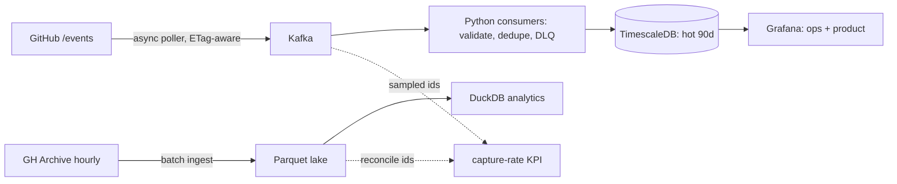

# RepoRadar — ecosystem intelligence for open source

RepoRadar ingests the public GitHub event firehose and turns it into three answers that
engineering teams actually need:

1. **"Is this project's momentum real?"** — trend detection with fake-star / coordinated-campaign
   screening, evaluated as alert precision under an explicit review budget.
2. **"Which of our dependencies are at risk of abandonment?"** — survival-analysis risk scores
   (who maintains what we depend on, and is the project decaying?), backtested for warning lead time.
3. **"What actually causes adoption?"** — event studies on natural experiments: license changes,
   front-page moments, CVE disclosures.

The core is deliberately boring and statistical: pipelines, reconciliation, baselines,
calibration. A local-LLM layer will eventually write weekly ecosystem briefs — with a plain
template fallback, so no model is ever a point of failure.

> **Status:** early development. In place today: ingestion foundations (a live `/events`
> poller with bounded deduplication and run counters, an always-on capture service writing
> hourly NDJSON files, idempotent GH Archive hour downloads), DuckDB archive analysis with
> the capture-rate calculator behind the `reporadar` CLI, and a local compose stack (Kafka,
> TimescaleDB, Grafana). The changelog tracks what is actually in place.

## The honest-ingestion design

GitHub's `/events` API is a **fast but lossy** window (pagination caps what one poller sees at
peak). [GH Archive](https://www.gharchive.org/) publishes the **complete but hourly** record.
RepoRadar is built to run both and measure the gap — **capture rate** is a first-class KPI,
not a footnote.



Design rules that hold everywhere:

- **Completeness is measured, never assumed.** The live stream is honest about what it misses;
  the archive is the arbiter.
- **Every model must beat a named dumb baseline on a time-based split** before it ships.
- **Person-level data is aggregated to repo/ecosystem level** in everything published. No
  individual-maintainer risk pages, ever.

## Development

```bash
make setup        # uv sync + install pre-commit hooks
make lint test    # zero-warning gate: ruff, mypy --strict, pytest
```

Python 3.12; dependencies and the toolchain are managed with [uv](https://docs.astral.sh/uv/).

## Usage

```bash
reporadar fetch-archive 2026-07-07 15     # download one GH Archive hour (.json.gz)
reporadar explore data/raw/gharchive/2026-07-07-15.json.gz   # event-type histogram
reporadar poll --cycles 10 --interval-s 10                   # sample the live /events feed
reporadar serve                                              # always-on capture service
reporadar consume                                            # stream → validated store
reporadar capture-rate <archive.json.gz> <live.ndjson>       # completeness KPI
```

`serve` polls until stopped, writing fresh events into hourly NDJSON files that mirror the
archive layout; Ctrl-C or SIGTERM ends the run cleanly after the current cycle.
`consume` is the other half: it reads the stream into the database, sending anything that
will not decode to the dead-letter topic, and stops on the same signals. It needs the local
stack running and `REPORADAR_POSTGRES_DSN` set.
`capture-rate` is only meaningful when the live sample's window overlaps the archive hour.

## Local stack

Kafka (KRaft), TimescaleDB, and Grafana for local development:

```bash
cp .env.example .env      # then set POSTGRES_PASSWORD and GRAFANA_ADMIN_PASSWORD
make up                   # start the stack (host ports are shifted off the defaults)
make logs                 # follow logs
make down                 # stop it
```

## Compliance

Independent research project; **not affiliated with or endorsed by GitHub**. Data comes from
the official GitHub REST API (authenticated, within published rate limits) and GH Archive —
no scraping. Person-level signals are aggregated to repo/ecosystem level in everything
published; raw event data is never redistributed as a dataset.

## License

[MIT](LICENSE)
